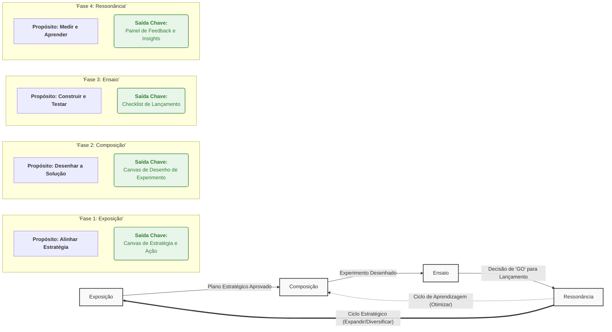

# A Metodologia Sinfonia

**Orquestrando o Desenvolvimento de Produtos de IA: Da Estratégia à Evolução Contínua.**

---

## O que é a Sinfonia?

A **Metodologia Sinfonia** é um framework ágil e estratégico, projetado para guiar equipes multidisciplinares na construção, lançamento e evolução de produtos complexos baseados em Inteligência Artificial.

Inspirada no "AI Design", a Sinfonia vai além, criando uma ponte estruturada entre a estratégia de negócio, o design centrado no ser humano e os desafios únicos da engenharia de IA.

Utilizamos a metáfora de uma **orquestra** para representar o processo: diferentes especialistas (os *músicos*) colaboram em harmonia, seguindo uma visão estratégica e um conjunto de artefatos (a *partitura*), guiados por uma liderança de produto clara (o *maestro*), para criar uma composição de valor (o *produto*).

## Filosofia e Princípios

Nossa filosofia central é:

> "Um framework para o design estratégico de produtos e negócios, fundamentado na aplicação e integração de múltiplas inteligências. Sua prática é guiada pelo aprendizado e evolução contínua com base em evidências, mantendo um compromisso fundamental com a geração de valor para clientes, o mercado e o próprio negócio."

Este trabalho é guiado por três pilares de **[Princípios-Chave]()**:
1.  **Pilares Estratégicos de Valor:** (Desejável, Viável, Factível, Defensável)
2.  **Abordagem de Criação e Inovação:** (Empatia Profunda, Colaboração Radical, Experimentação Contínua)
3.  **Motor de Evolução Contínua:** (Aprendizado por Evidências, Entrega Contínua de Valor, Adaptação Inteligente)

### Princípios-Chave

A execução da Sinfonia é guiada por um conjunto de princípios fundamentais, que garantem que a "música" seja não apenas bonita, mas também tecnicamente sólida e financeiramente viável.

- **Pilares Estratégicos de Valor**
    - **Desejável**: Resolve um problema real e cria valor percebido pelo cliente.
    - **Viável**: Garante a sustentabilidade e o alinhamento estratégico com o negócio e o mercado.
    - **Factível**: É tecnicamente realizável com os recursos e tecnologias disponíveis.
    - **Defensável**: Opera de forma ética, segura, transparente e em conformidade.
- **Abordagem de Criação e Inovação**
    - **Empatia Profunda**: A inovação parte de uma compreensão genuína das necessidades humanas.
    - **Colaboração Radical**: A integração de múltiplas inteligências exige a união de múltiplas expertises.
    - **Experimentação Sistemática**: Ideias são hipóteses a serem validadas rapidamente para gerar evidências.
- **Motor de Evolução Contínua**
    - **Aprendizado por Evidências**: A evolução do produto é guiada por dados e feedback, não por suposições.
    - **Entrega Contínua de Valor**: O valor é liberado em ciclos curtos e incrementais para acelerar o aprendizado.
    - **Adaptação Inteligente**: A estrutura se mantém ágil para responder a novas evidências e mudanças de contexto.

## O Modelo Cíclico: A Regra de Ouro da Sinfonia

A Sinfonia não é um processo linear com um fim. É um ciclo que se repete e evolui. A regra mais importante da metodologia é:

> Qualquer decisão estratégica de expansão significativa (seja por diversificação de funcionalidade, entrada em novo domínio ou expansão geográfica) deve ser tratada como um gatilho para iniciar um novo ciclo da metodologia Sinfonia, começando pela fase ```Exposição```.

Isso garante que novas frentes sejam tratadas com o mesmo rigor estratégico da composição original, reutilizando nossos artefatos enxutos e evitando a criação de documentos de planeamento monolíticos e redundantes.

## O Framework em Resumo

O diagrama abaixo ilustra o ciclo de vida da Sinfonia, com as suas quatro fases e os seus dois ciclos de feedback, que a tornam uma metodologia de evolução contínua.



## As Quatro Fases (Os "Movimentos")

  * **1. Exposição (Alinhar Estratégia):** Fase de imersão e descoberta. O foco é entender o domínio, o usuário e os dados para definir uma estratégia de projeto clara e consensual.
  * **2. Composição (Desenhar a Solução):** Fase de criatividade estruturada. O foco é gerar e priorizar ideias, desenhar os componentes da IA e projetar um experimento de baixo custo para validar a principal hipótese.
  * **3. Ensaio (Construir e Testar):** Fase de execução técnica. O foco é construir o MVP (Mínimo Produto Viável) em ciclos ágeis, garantir a sua qualidade técnica e preparar o lançamento de forma segura.
  * **4. Ressonância (Medir e Aprender):** Fase de aprendizado contínuo. O foco é monitorar o produto em produção, coletar dados e feedback, e tomar decisões estratégicas sobre a sua evolução.

## Os Artefatos (A "Partitura")

Este repositório contém os templates e exemplos para os 14 artefatos refinados da Metodologia Sinfonia.

| Fase | Artefato | Propósito | Template | Exemplo |
| :--- | :--- | :--- | :--- | :--- |
| **Exposição** | Canvas de Identificação do Domínio | Define e justifica o território de atuação do projeto. | [Link](./templates/Domain_Identification_Model_Canvas_Template.md) | [Link](./examples/Domain_Identification_Model_Canvas_Example.md) |
| | Persona Model Canvas | Cria um arquétipo do usuário principal, focando em suas dores e objetivos. | [Link](./templates/Persona_Model_Canvas_Template.md) | [Link](./examples/Persona_Model_Canvas_Example.md) |
| | Canvas de Mapeamento de Fontes de Dados | Avalia a qualidade, o acesso e os riscos das fontes de dados disponíveis. | [Link](./templates/Data_Source_Mapping_Model_Canvas_Template.md) | [Link](./examples/Data_Source_Mapping_Model_Canvas_Example.md) |
| | Canvas de Estratégia e Ação do Projeto | Consolida a visão, os KPIs e as primeiras ações táticas do projeto. | [Link](./templates/Project_Strategy_and_Action_Model_Canvas_Template.md) | [Link](./examples/Project_Strategy_and_Action_Model_Canvas_Example.md) |
| **Composição** | Registro de Design de Prompt | Documenta um prompt como um ativo de engenharia reutilizável. | [Link](./templates/Prompt_Design_Record_Model_Canvas_Template.md) | [Link](./examples/Prompt_Design_Record_Model_Canvas_Example.md) |
| | Canvas de Ideação de Soluções | Prioriza ideias de solução de forma visual com a matriz Impacto vs. Esforço. | [Link](./templates/Solution_Ideation_Model_Canvas_Template.md) | [Link](./examples/Solution_Ideation_Model_Canvas_Example.md) |
| | Canvas de Design de Experimento | Desenha um experimento enxuto (MVP) para validar a principal hipótese. | [Link](./templates/Experiment_Design_Model_Canvas_Template.md) | [Link](./examples/Experiment_Design_Model_Canvas_Example.md) |
| **Ensaio** | C4 Model (Templates) | Documenta a arquitetura de software em diferentes níveis de abstração. | [Link](./templates/C4_Model_Canvas_Template.md) | [Link](./examples/C4_Model_Canvas_Examples.md) |
| | Registro de Estratégia de Inteligência | Define a abordagem técnica da IA (RAG, Fine-tuning, etc.). | [Link](./templates/Intelligence_Strategy_Record_Model_Canvas_Template.md) | [Link](./examples/Intelligence_Strategy_Record_Model_Canvas_Example.md) |
| | Canvas de Testes e Validação | Planeja e documenta os testes de qualidade do sistema. | [Link](./templates/Testing_and_Validation_Model_Canvas_Template.md) | [Link](./examples/Testing_and_Validation_Model_Canvas_Example.md) |
| | Checklist de Lançamento | Garante a prontidão técnica e de negócio para o lançamento (Go/No-Go). | [Link](./templates/Launch_Checklist_Model_Canvas_Template.md) | [Link](./examples/Launch_Checklist_Model_Canvas_Example.md) |
| **Ressonância** | Canvas de Métricas de Escala e Impacto | Monitora o desempenho, o uso e o impacto do produto em produção. | [Link](./templates/Scale_and_Impact_Metrics_Model_Canvas_Template.md) | [Link](./examples/Scale_and_Impact_Metrics_Model_Canvas_Example.md) |
| | Canvas de Planejamento de Escalabilidade | Planeja proativamente a evolução da infraestrutura para suportar o crescimento. | [Link](./templates/Scalability_Planning_Model_Canvas_Template.md) | [Link](./examples/Scalability_Planning_Model_Canvas_Example.md) |
| | Painel de Feedback e Insights | Sintetiza feedback quantitativo e qualitativo em insights acionáveis. | [Link](./templates/Feedback_and_Insights_Panel_Model_Canvas_Template.md) | [Link](./examples/Feedback_and_Insights_Panel_Model_Canvas_Example.md) |

## Como Usar Este Repositório

1.  **Leia o E-book (Recomendado):** Para um aprofundamento completo na filosofia, nas atividades e nos papéis, consulte o [**e-book completo da Metodologia Sinfonia**]().
2.  **Explore a pasta `/templates`:** Contém todos os 14 artefatos em formato Markdown, prontos para serem usados.
3.  **Explore a pasta `/examples`:** Contém exemplos de preenchimento para cada artefato, baseados num estudo de caso de uma clínica médica.
4.  **Adapte ao seu contexto:** Sinta-se à vontade para clonar este repositório e adaptar os canvases às necessidades da sua equipe e do seu projeto.

## Contribuição

Este é um projeto aberto e em evolução. Se você tiver sugestões para melhorar a metodologia, os artefatos, ou se encontrar algum erro, por favor, abra uma **Issue** ou envie um **Pull Request**. A sua contribuição é muito bem-vinda\!

## Sobre o Autor

A Metodologia Sinfonia foi criada e refinada por **[Vinicius Cardoso Garcia](https://viniciusgarcia.me/)**. Para saber mais, conecte-se através do [**LinkedIn**](https://www.linkedin.com/in/viniciusgarcia) leia os [artigos dos debates que inspiraram a criação da metodologia](https://dev.to/vinicius3w/series/32001) ou explore outros projetos no [**GitHub**](https://github.com/assertlab).

## Licença

Este trabalho está licenciado sob a [**Licença Creative Commons Atribuição 4.0 Internacional**](https://www.google.com/search?q=link-para-a-licenca).
